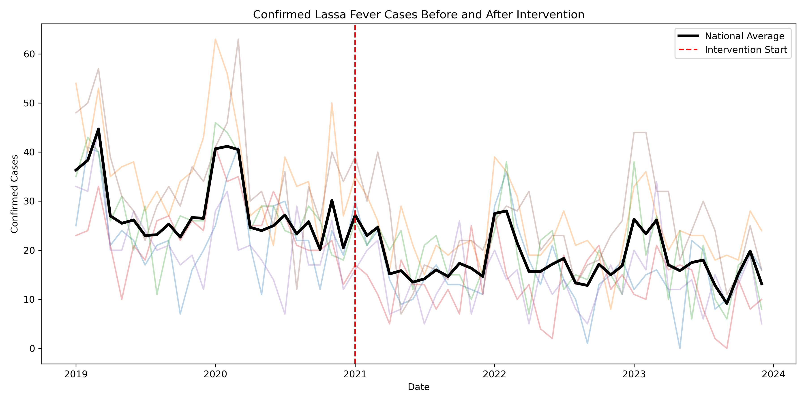
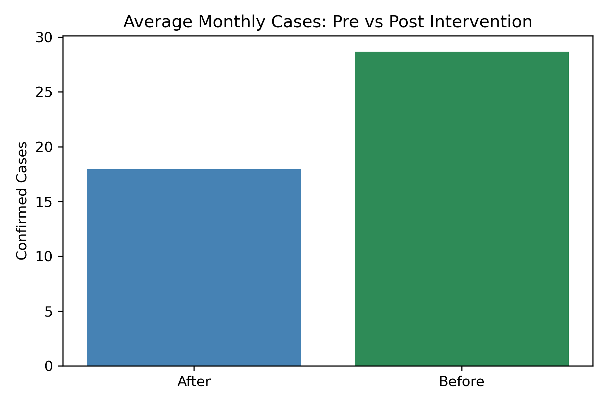
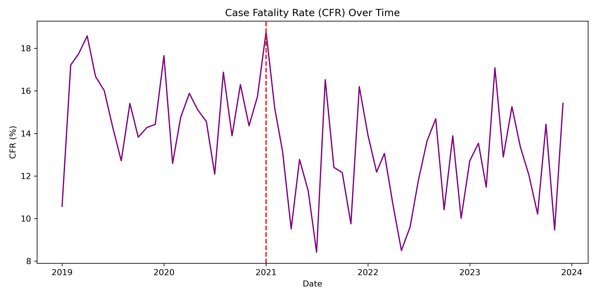

# Monitoring_Trends_of_Lassa_Fever_in_Nigeria

## Project Overview
- This project demonstrates how routine surveillance data can be used to monitor infectious disease trends and evaluate the impact of public health interventions.
  
- Using a simulated but realistic dataset reflecting Lassa fever patterns in Nigeria (2019-2023), the analysis examines changes in confirmed cases, deaths, and case fatality rate (CFR) before and after aaa modeled intervention introduced in early 2021.
  
- This project is designed to showcase a practical, decision-support approach suitable for Monitoring & Evaluation (M&E) teams, public health NGOs, and program managers.

☑️ Objectives

- Monitor temporal trends in confirmed Lassa fever cases.
  
- Assess the impact of a public health intervention using pre/post comparison.

- Evaluate changes in disease severity using CFR.

- Translate statistical findings into clear, actionable insights.

📂 Data Description

- Time period: 2019-2023(monthly)

- Geographic scope: Six Nigerian states

- Key variables:

 - Confirmed cases
 - Deaths
 - Case Fatality Rate (CFR)
 - Intervention phase (Before / After)
 - Rolling average of cases

❎ Note: The dataset is simulated for analytical demonstration and does not represent official surveillance data. 

🔍 Methods

- Descriptive time-series analysis

- Rolling averages to smooth short-term fluctuations

- Pre- vs post-intervention comparison

- Visual trend inspection with intervention marker

- All analysis was conducted in Python using reproducible methods.

📈 Key Insights

- Confirmed cases were higher and more volatile before the intervention period.

- A strong and sustained reduction in average monthly cases was observed after the intervention.

- CFR showed visible fluctuations but became more stable post-intervention.

- Results suggest improved disease control following program implementation.

🧠 Programmatic Implications

- Supports evidence-based program evaluation

- Enables early detection of adverse trend shifts

- Improves communication of impact to non-technical stakeholders

- Provides a reusable monitoring framework for other disease or regions

📂 Repository Contents

📔 Analysis Notebook: 'monitoring_trends_and_evaluation_impact_of_Lassa_fever_in_Nigeria.ipynb'
📊 Dataset: 'simulated_lassa_program_data_nigeria.xls'

🗒️Transparency

This project uses simulated data created to reflect realistic epidemiological patterns in Nigeria. It is intended solely for demonstration and learning purposes. 

📊 Key Visuals

### Intervention Impact on Confirmed Cases

### Pre vs Post Intervention Comparison

### Case Fatality Rate Trend

   
